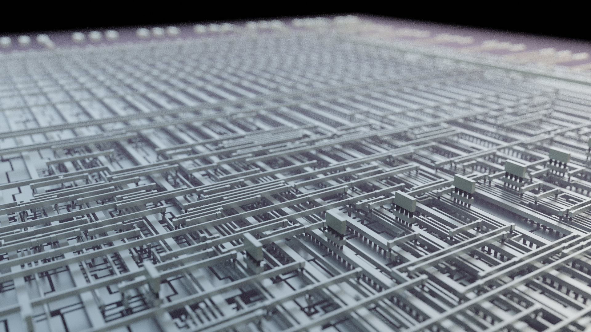
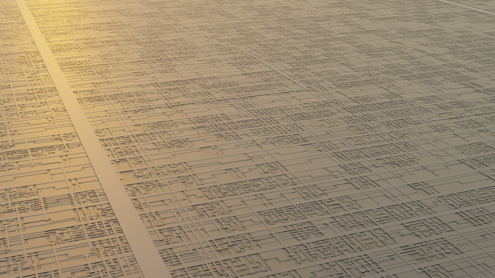
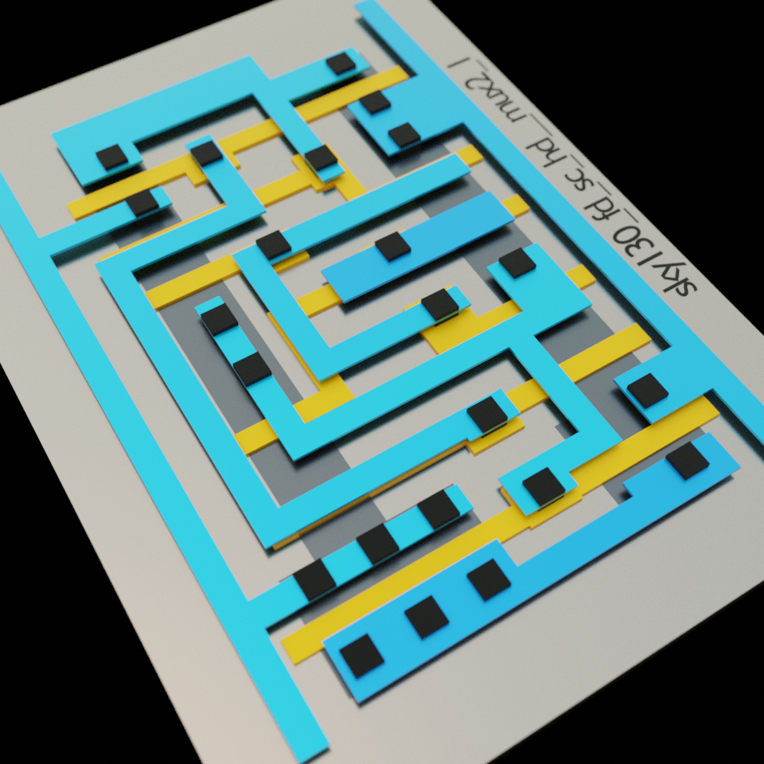
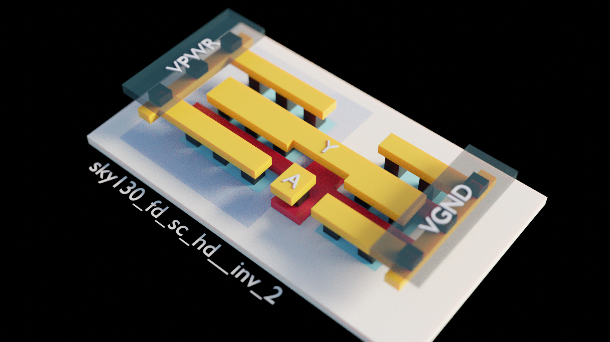
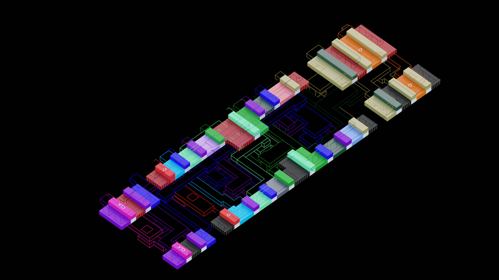

## Repository created to go with the walkthrough video we made with Matt Venn about rendering GDS files in Blender
https://www.youtube.com/watch?v=gBjQI3GrBHU

---

## Overview 

---

## GDS to STL conversion steps
Have the .gds file ready

Clone gdsiistl: 
`git clone https://github.com/mbalestrini/gdsiistl`

Install gdsiistl python requirements: 
`pip3 install -r requirements.txt`

Edit `gdsiistl.py` to enable or disable the layers you are interested in converting:
Search for the `layerstack` variable and modify it to enable or disable layers. You can also change the vertical bottom and top position for each generated layer geometry (default is bottom=0 and top=0.1)

If your are going to do always the same style of render it's better to set all the layer z values directly, so everything will be setup automatically (position & height) when you import the files in blenders

If you need a reference for the layer number and datatype for sky130 you can check here: https://skywater-pdk.readthedocs.io/en/main/rules/layers.html#gds-layers-information
And here: https://www.zerotoasiccourse.com/terminology/pdk/

. Run the GDS to STL convertion:
`python3 ../gdsiistl/gdsiistl.py name_of_gds_file.gds`

You will have one .stl file for each layer in the stack

## Blender importing and scene creation
Create the blender project.
(I'm using blender 2.91.0)

    Import Layers: 
        Import the layer STL file
            Leave import scale at 1.0 if you want units in blender to represent microns (1m > 1um)
        With the new object selected create a new material and change the color (to visually identify the different layers, specially while you are setting up the scene)
        Move layers in the Z axis to place them as you want
        Scale layer vertically (Z) if you want different layer heights
        If you chose to go for the more a look closer to reallity you can check SKY130 layer heights and positions here: https://www.zerotoasiccourse.com/terminology/pdk/
        
    Change Render Engine to Cycles

    To preview how the render would look like while setting up the scene change the Viewport Shading to: Rendered

    Delete default light

    Create the ambient lighting
        World Properties > Surface > Color (dot) > Sky Texture
            Play with the different Sky Texture parameters (sin disc, elevation, strenght) 
            
    Setting up the different layer materials
        Select each layer and play with the different properties of the layer Material
            Some of the most useful ones: Base Color, Specular, Roughness, Metallic, Alpha, Emission
    
    Camera setup
        Move/Rotate the camera object manually on the scene or align the camnera to your current viewport with:
        View > Align active camera to view
        
        Activate the camera if you want the viewport to show what the camera will show:
        View > Cameras > Active Camera

        Refine or change the camera view using some of the navigation methods:
        View > Navigation > Walk Navigation
        View > Navigation > Fly Navigation

        Change the focal length of the camera to go with wide or tele lens styles

        Enable Depth of Field and set focus distance and f-stop on the camera if you want to use that effect (render will be a little bit slower, so don't do it if you don't need that)

    Render
        Some useful render parameters to play with:
            Render Properties > Sampling > Render sample (to change between render speed and accuracy)
            Render Properties > Performnace > Tiles > Progressive Refine (render the whole image at once and progressively refines it, instead of doing it by small areas )
            Output properties > Dimension > Resolution X, Y and %

---    

## Example files

I've added a GDS file and two example Blender files to play around with

`wrapped_vga_clock.gds` (design created by Matt Venn for the Google Skywater shuttle program)

`exampleA.blend` (based on importing the wrapped_vga_clock.gds layers)

`example_sky130_fd_sc_hd__mux2_1.blend` (based on importing SKY130 PDK standard cell MUX2_1)

The blender files have two cameras setups each to try 

## Example renders

Some cool renders I did with Blender 

