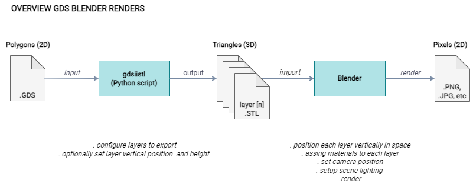

# WIP:

## TODO

Put some nice example renders

## Links?

https://github.com/mbalestrini/gdsiistl

---

## Overview ?

## Detailed Steps

? Have the .gds file ready

Clone gdsiistl: 
`git clone https://github.com/mbalestrini/gdsiistl`

Install gdsiistl python requirements: 
`pip3 install -r requirements.txt`

Edit `gdsiistl.py` to enable or disable the layers you are interested in converting:
Search for the `layerstack` variable and modify it to enable or disable layers. You can also change the vertical bottom and top position for each generated layer geometry (default is bottom=0 and top=0.1)

If you need a reference for the layer number and datatype for sky130 you can check here: https://skywater-pdk.readthedocs.io/en/main/rules/layers.html#gds-layers-information

Run the GDS to STL convertion:
`python3 ../gdsiistl/gdsiistl.py name_of_gds_file.gds`

Create the blender project:
(I'm using blender 2.91.0)

    New 
    Save As ...
    Import Layers: 
        Import STL 
            ? Set scale = 1.0 (so blender units represent microns)
        Create material 
        Move Layer vertically
        Scale layer vertically if you want different layer heights
        >>> Example of scaling some layer/s

    Change Render Engine to Cycles
    Show how to change viewport shading style
    Delete default light
    Change World Properties > Surface > Color > Sky Texture
        Sun Disc (for hard shadow)
        Change Strength 

    Material properties to play
        Base Color
        Specular
        Roughness
        Metallic
        
        Alpha
        Emission
    
    Camera?
        View > Align active camera to view
        View > Navigation > Walk Navigation
        Focal Length
       * Depth of Field
    Render
        Basic/useful render settings
            Sampling presets
            Performnace > Progressive Refine

        Output properties
            Resolution
            Pergentage (as an easy way to do small tests)

    Save Render

    Special Shading
        Use Nodes 
            Colour per island?

